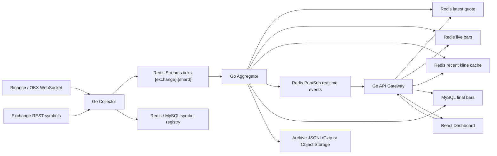

# Go 实时行情系统与 Dashboard 开发文档

> 说明：本文档中的 `tick` 指交易所成交级行情事件。用户口头说的 `ticket` 在本文档里统一写作 `tick`。

## 1. 目标

把当前 Python 版 `crypto-ticket` 升级为一个可支撑 tick 级实时访问、实时 Dashboard、最近 K 线缓存查询和长期历史存储的 Go 行情系统。

核心目标：

- 支持 Binance、OKX 等交易所 WebSocket tick 采集。
- HTTP 查询某个 symbol 最新行情时，返回 tick 级最新数据，不访问 MySQL。
- Dashboard 支持实时 tick 更新和当前未完成 K 线更新。
- HTTP 查询最近 300 根 K 线时，优先走 Redis 缓存，不频繁访问 MySQL。
- 最终 K 线可靠落库，支持回放、回填、重建高周期。
- 系统可从单机部署起步，后续可以平滑演进到 Redis 分片、Kafka/Flink 或 MySQL 分库分表。

非目标：

- 第一阶段不做全量 tick 历史的 MySQL 存储。
- 第一阶段不上 Flink，除非单机 Go 聚合和 Redis Stream 已经明确成为瓶颈。
- 不把 MySQL 当实时行情缓存使用。

## 2. 总体架构

推荐架构：



第一阶段可以用一个 Go 进程部署：

```text
marketd
  - collector goroutines
  - aggregator goroutines
  - api/http/ws server
```

第二阶段再拆成独立服务：

```text
collector
aggregator
api
dashboard
maintenance
```

## 3. 技术选型

### 3.1 后端

推荐：

- Go 1.22+。
- HTTP：标准库 `net/http` + `chi` router。
- WebSocket：`gorilla/websocket` 或 `coder/websocket`，二选一并固定。
- Redis 客户端：`go-redis`。
- MySQL 客户端：`go-sql-driver/mysql` 或 `sqlc` 生成访问层。
- 配置：环境变量 + YAML，使用 `viper` 或轻量自研配置加载。
- 日志：`zap` 或 `slog`。
- 指标：Prometheus client + `/metrics`。
- Trace：OpenTelemetry，后续接入。

### 3.2 Dashboard

推荐成熟前端架构：

```text
Vite + React + TypeScript
TanStack Query
Zustand
TanStack Router 或 React Router
Lightweight Charts
Ant Design / Semi UI
Vitest + Playwright
OpenAPI generated client
```

为什么不首选 Next.js：

- 这个 Dashboard 是实时行情终端，主要价值在浏览器端 WebSocket 和图表交互。
- SSR 对实时行情页面帮助不大，反而增加 Node 服务运行成本。
- Vite SPA 可以由 Go API 静态托管，部署链路更简单。

什么时候考虑 Next.js：

- 需要复杂权限、服务端渲染、统一企业门户、文档站和多租户 SSR。
- 需要把 Dashboard 作为独立前端平台长期演进。

### 3.3 存储

第一阶段：

- Redis：实时状态、最近 K 线缓存、Pub/Sub、Stream。
- MySQL：symbol 元数据、bar checkpoint、最终 K 线热表。
- 本地归档或对象存储：最终 1m K 线压缩归档。

第二阶段：

- MySQL：继续作为唯一后端历史存储，通过分区、批量写、冷热归档和读缓存扩展容量。

不建议：

- 每个 tick 都写 MySQL。
- Dashboard 每秒查 MySQL。
- HTTP 最新行情接口读 MySQL。

## 4. 服务拆分

### 4.1 Collector

职责：

- 定期拉交易所 REST symbol 列表。
- 维护 active symbol universe。
- 建立交易所 WebSocket 连接。
- 动态订阅/取消订阅 symbol。
- 标准化交易所消息为内部 `Tick`。
- 写 Redis Stream。
- 可选写 Redis latest quote，降低 tick 最新价延迟。

输入：

- Binance/OKX REST。
- Binance/OKX WebSocket。

输出：

```text
ticks:{exchange}:{shard}
symbol:{exchange}:{symbol}
symbols:{exchange}
```

Collector 不做 K 线聚合。

### 4.2 Aggregator

职责：

- 消费 Redis Stream tick。
- 按 `(exchange, symbol)` 维护内存窗口状态。
- 每个 tick 更新 latest quote。
- 每个 tick 更新当前未完成 K 线。
- 节流写 Redis live bar。
- 窗口收盘时生成 final bar。
- final bar 写 Redis recent cache。
- final bar 批量写 MySQL。
- 发布实时事件给 API WebSocket 服务。

关键要求：

- 同一个 `(exchange, symbol)` 必须由同一个 aggregator shard 处理，保证顺序和状态一致。
- final bar 写库要幂等。
- Redis Stream ack 必须在 tick 更新状态和必要持久化动作完成后执行。

### 4.3 API Gateway

职责：

- HTTP 最新行情查询。
- HTTP 最近 K 线查询。
- HTTP symbol 列表和系统状态。
- WebSocket 订阅与推送。
- Dashboard 静态文件托管。
- Redis 缓存 read-through。
- DB fallback。

API 不直接连接交易所。

### 4.4 Maintenance

职责：

- 从归档回填 DB。
- 从 1m 重建高周期。
- 修复 Redis recent cache。
- 比对 Go/Python 聚合结果。
- 定时清理冷门缓存。

## 5. 数据模型

### 5.1 Tick

```go
type Tick struct {
    Exchange  string          `json:"exchange"`
    Symbol    string          `json:"symbol"`
    TsMS      int64           `json:"ts_ms"`
    Price     decimal.Decimal `json:"price"`
    Size      decimal.Decimal `json:"size"`
    Side      string          `json:"side,omitempty"`
    TradeID   string          `json:"trade_id,omitempty"`
    EventType string          `json:"event_type"`
    Source    string          `json:"source"`
    Raw       json.RawMessage `json:"raw,omitempty"`
}
```

金额和数量建议内部使用 decimal 或定点整数，避免 float 误差。若为了性能第一阶段使用 `float64`，DB 写入和 JSON 返回要统一格式，后续可替换。

### 5.2 Bar

```go
type Bar struct {
    Exchange    string          `json:"exchange"`
    Symbol      string          `json:"symbol"`
    Timeframe   string          `json:"timeframe"`
    StartMS     int64           `json:"start_ms"`
    EndMS       int64           `json:"end_ms"`
    Open        decimal.Decimal `json:"open_price"`
    High        decimal.Decimal `json:"high_price"`
    Low         decimal.Decimal `json:"low_price"`
    Close       decimal.Decimal `json:"close_price"`
    Volume      decimal.Decimal `json:"volume"`
    QuoteVolume decimal.Decimal `json:"quote_volume"`
    TradeCount  int64           `json:"trade_count"`
    LastTickMS  int64           `json:"last_tick_ms"`
    IsFinal     bool            `json:"is_final"`
    Source      string          `json:"source"`
    Reason      string          `json:"reason"`
    UpdatedAtMS int64           `json:"updated_at_ms"`
}
```

### 5.3 Symbol

```go
type SymbolInfo struct {
    Exchange    string          `json:"exchange"`
    Symbol      string          `json:"symbol"`
    MarketType  string          `json:"market_type"`
    Status      string          `json:"status"`
    IsActive    bool            `json:"is_active"`
    FirstSeenMS int64           `json:"first_seen_at_ms"`
    LastSeenMS  int64           `json:"last_seen_at_ms"`
    Raw         json.RawMessage `json:"raw"`
}
```

## 6. Redis 设计

### 6.1 Stream

按 exchange 和 shard 拆 stream：

```text
ticks:{exchange}:{shard}
```

示例：

```text
ticks:binance:00
ticks:binance:01
ticks:okx:00
```

shard 计算：

```text
shard = hash(exchange + ":" + symbol) % N
```

这样同一个 symbol 的 tick 会进入同一个 stream，方便保持顺序。

Stream fields：

```text
exchange
symbol
ts_ms
price
size
side
trade_id
event_type
source
raw
recv_ms
```

Consumer group：

```text
group: market-aggregator
consumer: aggregator-{instance}-{shard}
```

第一阶段每个 shard 只允许一个 active aggregator consumer。后续扩容时增加 shard 数，而不是让多个 consumer 抢同一个 symbol 的状态。

### 6.2 最新 tick

Key：

```text
quote:{exchange}:{symbol}
```

类型：Hash。

字段：

```text
ts_ms
price
size
side
trade_id
event_type
recv_ms
updated_at_ms
```

TTL：

```text
活跃 symbol：120 秒
不活跃 symbol：由 symbol reconcile 删除或自然过期
```

写入策略：

- 每个 tick 都写。
- 使用 pipeline 合并 `HSET` + `EXPIRE`。

HTTP 最新行情只读这个 key。

### 6.3 当前未完成 K 线

Key：

```text
livebar:{exchange}:{symbol}:{timeframe}
```

类型：String JSON 或 Hash。推荐 String JSON，便于原样返回和 Pub/Sub 推送。

TTL：

```text
1m: 5 分钟
5m/15m/30m: 1 小时
1H/2H/4H/6H/12H: 2 天
1D 以上: 30 天
```

写入策略：

- 内存状态每 tick 更新。
- Redis 写入按 `(exchange, symbol, timeframe)` 节流，默认 100ms 到 250ms。
- final 后删除旧 livebar 或写入 `is_final=true` 后短 TTL。

### 6.4 最近 K 线缓存

每个 `(exchange, symbol, timeframe)` 两个 key：

```text
kline:idx:{exchange}:{symbol}:{timeframe}
kline:bar:{exchange}:{symbol}:{timeframe}
```

`kline:idx`：

- 类型：Sorted Set。
- score：`start_ms`。
- member：`start_ms` 字符串。

`kline:bar`：

- 类型：Hash。
- field：`start_ms` 字符串。
- value：bar JSON。

缓存条数：

```text
热门 symbol: 1000
普通 symbol: 300
冷门 symbol: read-through 后 300，TTL 10-30 分钟
```

写 final bar 时：

```text
ZADD kline:idx:{...} start_ms start_ms
HSET kline:bar:{...} start_ms bar_json
ZREMRANGEBYRANK kline:idx:{...} 0 -(max_keep+1)
HDEL kline:bar:{...} old_start_ms...
```

查询最近 300：

```text
ZREVRANGE kline:idx:{...} 0 299
HMGET kline:bar:{...} start_ms...
reverse to ascending
merge livebar
```

如果 Redis 不足 300 根：

```text
DB query latest 300
backfill Redis cache
merge livebar
return
```

### 6.5 Pub/Sub 事件

频道：

```text
pub:ticker:{exchange}:{symbol}
pub:kline:{exchange}:{symbol}:{timeframe}
pub:system
```

用途：

- Aggregator 发布事件。
- API Gateway 订阅事件。
- API Gateway 再转发给 WebSocket 客户端。

Pub/Sub 是易失的，断线后客户端通过 HTTP 补最新快照。

## 7. 聚合逻辑

### 7.1 每个 tick 到来时

处理流程：

```text
1. 校验 tick 时间、价格、数量。
2. 更新 quote:{exchange}:{symbol}。
3. 对所有 timeframe 计算 bucket_start/bucket_end。
4. 更新内存 RollingBarState。
5. 对当前被更新的 live bar 做 Redis 节流写。
6. 发布 ticker event。
7. 发布 kline live event。
8. 如果发现窗口已结束，生成 final bar。
9. final bar 写 Redis recent cache。
10. final bar 放入 DB batch。
11. Redis Stream ack。
```

### 7.2 时间窗口

支持周期：

```text
1m 5m 15m 30m 1H 2H 4H 6H 12H 1D 2D 3D 5D 1W 2W 1M 3M
```

窗口计算必须独立成包：

```text
internal/timeframe
  - Normalize(tf)
  - FloorStart(ts, tf)
  - NextStart(start, tf)
  - End(start, tf)
```

### 7.3 late tick 策略

默认策略：

- 当前窗口允许 `close_grace = 2s`。
- 在 grace 内到达的 tick 可以更新当前窗口。
- 超过 grace 才到达的旧 tick 第一阶段忽略，并计入指标。
- 后续如果需要严格修正，增加 correction event 和历史 bar 修正流程。

### 7.4 gap bar 策略

如果某个 symbol 某个周期中间没有 tick：

- 生成 gap bar。
- open/high/low/close 使用上一根 close。
- volume、quote_volume、trade_count 为 0。
- `reason = "gap"`。
- `is_final = true`。

### 7.5 高周期生成方式

第一阶段建议：

- tick 直接更新所有 timeframe 的 live state。
- final bar 可以仍以 1m final 为基础重建高周期，用于历史一致性。

这样 Dashboard 能 tick 级看到任意 timeframe 当前未完成 K 线，而历史最终 K 线仍保持可重建。

## 8. 数据库设计

### 8.1 MySQL 保留表

`symbol_registry`：

- 保存交易对元数据。
- Dashboard symbol 列表来自这里或 Redis 缓存。

`bar_checkpoint`：

- 每个 `(exchange, symbol, timeframe)` 最新 bar。
- 可用于服务重启恢复、Dashboard snapshot fallback。

`bar_history`：

- 第一阶段可以继续保留最终 K 线热表。
- 只写 final bar，不建议每 tick 更新未完成 bar。

`collector_checkpoint`：

- 新增。
- 记录 collector symbol refresh、ws reconnect、stream shard 状态。

`agg_checkpoint`：

- 新增。
- 记录每个 shard 最后处理 stream id、最后 flush 时间、状态版本。

### 8.2 MySQL 扩展建议

后端存储保持 MySQL。数据量变大后，优先做这些扩展：

- `bar_history` 按月份或周分区，分区键保留 `exchange,start_ms`。
- 热数据保留在 MySQL，冷数据压缩归档到文件或对象存储。
- API 查询最近 300 根必须优先走 Redis，不直接放大 MySQL QPS。
- final bar 使用批量 upsert，避免每根 K 线单独开事务。
- tick 历史默认不写 MySQL；确有回放需求时，单独建按日分区的 `tick_history`，并设置保留期。

可选 `tick_history`：

```sql
CREATE TABLE IF NOT EXISTS tick_history (
  exchange VARCHAR(16) NOT NULL,
  symbol VARCHAR(64) NOT NULL,
  ts_ms BIGINT NOT NULL,
  price DECIMAL(28, 12) NOT NULL,
  size DECIMAL(28, 12) NOT NULL DEFAULT 0,
  side VARCHAR(8) DEFAULT NULL,
  trade_id VARCHAR(128) NOT NULL DEFAULT '',
  recv_ms BIGINT NOT NULL,
  created_at TIMESTAMP NOT NULL DEFAULT CURRENT_TIMESTAMP,
  PRIMARY KEY (exchange, symbol, ts_ms, trade_id),
  KEY idx_tick_time (exchange, ts_ms)
);
```

## 9. HTTP API

### 9.1 最新 tick

```http
GET /api/v1/ticker/latest?exchange=binance&symbol=BTCUSDT
```

数据源：

```text
Redis quote:{exchange}:{symbol}
```

不访问 MySQL。

返回：

```json
{
  "exchange": "binance",
  "symbol": "BTCUSDT",
  "ts_ms": 1779330000123,
  "price": "103000.12",
  "size": "0.004",
  "side": "buy",
  "trade_id": "12345",
  "updated_at_ms": 1779330000130
}
```

### 9.2 最近 K 线

```http
GET /api/v1/klines?exchange=binance&symbol=BTCUSDT&timeframe=1m&limit=300&include_live=true
```

数据源优先级：

```text
Redis recent kline cache
DB fallback
Redis livebar merge
```

规则：

- `limit` 默认 300，最大 1000。
- 默认 `include_live=true`。
- 如果 live bar 的 `start_ms` 等于最后一根历史 bar，替换最后一根。
- 如果 live bar 的 `start_ms` 大于最后一根历史 bar，append。
- 返回按时间升序。

### 9.3 Symbol 列表

```http
GET /api/v1/symbols?exchange=binance&active=true
```

数据源：

```text
Redis symbols cache
MySQL fallback
```

### 9.4 Snapshot

```http
GET /api/v1/snapshot?exchange=binance&symbol=BTCUSDT
```

返回：

- 最新 tick。
- 每个 timeframe 当前 live bar。
- 最新 final checkpoint。
- symbol metadata。

### 9.5 健康检查

```http
GET /healthz
GET /readyz
GET /metrics
```

`readyz` 必须检查：

- Redis 可访问。
- DB 可访问。
- API Pub/Sub 正常。

## 10. WebSocket 协议

连接：

```text
GET /api/v1/ws
```

客户端订阅：

```json
{
  "op": "subscribe",
  "req_id": "1",
  "channels": [
    { "type": "ticker", "exchange": "binance", "symbol": "BTCUSDT" },
    { "type": "kline", "exchange": "binance", "symbol": "BTCUSDT", "timeframe": "1m" }
  ]
}
```

服务端 ack：

```json
{
  "op": "subscribed",
  "req_id": "1",
  "channels": [
    { "type": "ticker", "exchange": "binance", "symbol": "BTCUSDT" },
    { "type": "kline", "exchange": "binance", "symbol": "BTCUSDT", "timeframe": "1m" }
  ]
}
```

Ticker event：

```json
{
  "type": "ticker",
  "seq": 1024,
  "exchange": "binance",
  "symbol": "BTCUSDT",
  "ts_ms": 1779330000123,
  "price": "103000.12",
  "size": "0.004",
  "side": "buy"
}
```

Kline event：

```json
{
  "type": "kline",
  "seq": 2048,
  "exchange": "binance",
  "symbol": "BTCUSDT",
  "timeframe": "1m",
  "bar": {
    "start_ms": 1779330000000,
    "end_ms": 1779330059999,
    "open_price": "103000.00",
    "high_price": "103010.00",
    "low_price": "102990.00",
    "close_price": "103000.12",
    "volume": "12.4",
    "quote_volume": "1277201.48",
    "trade_count": 88,
    "last_tick_ms": 1779330000123,
    "is_final": false
  }
}
```

心跳：

```json
{ "op": "ping", "ts_ms": 1779330000000 }
{ "op": "pong", "ts_ms": 1779330000001 }
```

断线恢复：

- 客户端重连后重新订阅。
- 先 HTTP 拉 `/klines?limit=300&include_live=true`。
- 再接 WebSocket 增量。
- 如果发现 seq gap，重新 HTTP 拉快照。

## 11. Dashboard 架构

### 11.1 目录结构

```text
web/
  src/
    app/
      routes/
      providers/
    entities/
      market/
      symbol/
      kline/
    features/
      market-subscription/
      symbol-search/
      timeframe-switcher/
    widgets/
      market-chart/
      ticker-tape/
      symbol-sidebar/
      health-panel/
    shared/
      api/
      ws/
      chart/
      ui/
      config/
      utils/
```

### 11.2 页面

`/markets`：

- 交易所切换。
- symbol 搜索。
- timeframe 切换。
- K 线图。
- 最新 tick 面板。
- 当前 bar 面板。
- 最近 tick tape。
- 连接状态。

`/symbols`：

- active/inactive symbol 列表。
- market type、status、last seen。

`/system`：

- Collector 状态。
- Aggregator lag。
- Redis Stream pending。
- DB batch lag。
- WebSocket 在线连接数。

`/backfill`：

- 触发历史回填。
- 重建高周期。
- 查看任务状态。

### 11.3 前端数据流

首屏：

```text
1. 读取 URL 参数 exchange/symbol/timeframe。
2. TanStack Query 拉 meta/symbols。
3. TanStack Query 拉最近 300 根 K 线。
4. 建立 WebSocket。
5. 订阅 ticker + 当前 timeframe kline。
```

实时：

```text
ticker event -> 更新 latest quote store + tick tape
kline event -> Lightweight Charts series.update()
final bar -> 替换/追加最后一根 bar，并更新 query cache
seq gap -> invalidate query，重新拉最近 300 根
```

### 11.4 状态管理

TanStack Query 管：

- `/symbols`
- `/klines`
- `/snapshot`
- `/system`

Zustand 管：

- 当前 exchange/symbol/timeframe。
- WebSocket 连接状态。
- UI 展开/收起。
- chart crosshair 选中 bar。
- 用户偏好设置。

WebSocket manager 管：

- 单例连接。
- 自动重连。
- 订阅去重。
- 心跳。
- seq gap 检测。
- channel event 分发。

### 11.5 图表更新策略

初始化：

```text
candleSeries.setData(last300Bars)
volumeSeries.setData(last300Volumes)
```

收到 live kline：

```text
candleSeries.update(bar)
volumeSeries.update(volume)
```

收到 final kline：

```text
same start_ms -> update last bar is_final=true
new start_ms -> append
```

切换 symbol/timeframe：

```text
unsubscribe old channels
clear chart
load HTTP snapshot
subscribe new channels
```

## 12. 缓存策略

### 12.1 API 本地缓存

API 进程内加一个短 TTL LRU：

```text
latest quote: 50ms-100ms
recent klines: 100ms-500ms
symbols: 5s-30s
```

作用：

- 多个用户同时看 BTCUSDT 时，挡住瞬时重复 Redis 请求。
- 不影响实时性。

### 12.2 Redis read-through

查询最近 300 根：

```text
1. 查 Redis。
2. Redis 命中 >= limit，返回。
3. Redis 不足，查 DB。
4. DB 结果回填 Redis。
5. 合并 livebar。
```

### 12.3 热点预热

启动时预热：

```text
BTCUSDT
ETHUSDT
SOLUSDT
OKX BTC-USDT-SWAP
OKX ETH-USDT-SWAP
```

也可以按访问计数动态提升：

```text
symbol_access:{exchange}:{symbol}
```

访问频繁的 symbol 提升缓存条数和 TTL。

## 13. 性能目标

第一阶段建议指标：

```text
tick ingest -> Redis Stream p99 < 50ms
Redis Stream -> livebar p99 < 200ms
HTTP latest ticker p99 < 20ms
HTTP latest 300 klines Redis hit p99 < 50ms
Dashboard WS live update p99 < 300ms
DB final bar batch flush interval <= 1s
Redis kline cache hit rate > 95% for dashboard traffic
```

容量假设：

```text
active symbols: 1000-3000
tick rate: 5k-50k/sec
timeframes: 17
dashboard users: 10-200
```

超过这个量级后评估 Kafka/Flink、Redis 分片和 MySQL 分库分表。

## 14. 可靠性设计

### 14.1 幂等

final bar 主键：

```text
exchange + symbol + timeframe + start_ms
```

MySQL 以这个维度去重或覆盖。

### 14.2 状态恢复

Aggregator 启动时：

```text
1. 从 Redis aggstate 恢复 live state。
2. 如果没有 aggstate，从 DB bar_checkpoint 恢复上一根 close。
3. 从 Redis Stream 当前新消息继续消费。
```

新增 key：

```text
aggstate:{exchange}:{shard}
```

每 1 秒或每 N 条 tick 保存一次状态摘要。

### 14.3 Redis Stream pending

启动时处理：

- 先 claim 超时 pending 消息。
- 再消费新消息。

如果单 shard 只有一个 consumer，也要定期检查 pending，避免崩溃后消息卡住。

### 14.4 DB 批量写

Aggregator 内部维护 batch：

```text
max_rows = 1000
flush_interval = 1s
```

DB 写失败：

- 重试指数退避。
- 超过阈值写本地 WAL 文件。
- 告警。
- 不影响 Redis livebar 和 Dashboard 实时显示。

## 15. 配置

示例：

```yaml
app:
  env: dev
  log_level: info

redis:
  url: redis://127.0.0.1:6379/0
  stream_maxlen: 1000000
  shard_count: 16

mysql:
  enabled: true
  dsn: root:root123@tcp(127.0.0.1:3306)/crypto_ticket

market:
  timeframes: ["1m", "5m", "15m", "30m", "1H", "4H", "1D"]
  close_grace_ms: 2000
  livebar_flush_ms: 100
  recent_cache_limit: 300
  hot_cache_limit: 1000

api:
  host: 127.0.0.1
  port: 8088
  ws_ping_interval: 15s

exchanges:
  binance:
    enabled: true
    market_type: um_futures
    rest_url: https://fapi.binance.com
    ws_url: wss://fstream.binance.com/ws
  okx:
    enabled: true
    market_type: SWAP
    rest_url: https://www.okx.com
    ws_url: wss://ws.okx.com:8443/ws/v5/public
```

## 16. 开发里程碑

### Phase 0：接口与测试基线

交付：

- Go module 初始化。
- `internal/market` 模型。
- `internal/timeframe` 时间窗口库。
- OpenAPI 草案。
- WebSocket message schema。
- 聚合器单元测试覆盖当前 Python 行为。

验收：

- `1m/5m/15m/1H/1D/1W/1M` bucket 计算测试通过。
- gap bar 测试通过。
- late tick 策略测试通过。

### Phase 1：Collector

交付：

- Binance adapter。
- OKX adapter。
- symbol reconcile。
- Redis Stream writer。
- collector metrics。

验收：

- 能写入 `ticks:{exchange}:{shard}`。
- active symbol 能写 Redis/MySQL。
- WS 断线自动重连。
- 订阅变更自动同步。

### Phase 2：Aggregator + Redis 实时缓存

交付：

- Redis Stream consumer。
- tick -> livebar。
- tick -> latest quote。
- final bar -> recent kline cache。
- final bar -> MySQL。
- Pub/Sub realtime events。

验收：

- HTTP 读 Redis 能看到 tick 级 latest quote。
- 当前 1m 未完成 K 线能在 Redis livebar 看到。
- 最近 300 根 K 线 Redis 命中。
- final K 线和 Python 聚合结果一致。

### Phase 3：Go API

交付：

- `/api/v1/ticker/latest`。
- `/api/v1/klines`。
- `/api/v1/symbols`。
- `/api/v1/snapshot`。
- `/api/v1/ws`。
- `/metrics`、`/healthz`、`/readyz`。

验收：

- 最新行情接口不访问 MySQL。
- 最近 300 K 线接口 Redis 命中时不访问 MySQL。
- Redis miss 能 DB fallback 并回填。
- WebSocket 可订阅 ticker/kline。

### Phase 4：Dashboard

交付：

- Vite React TypeScript 项目。
- Market terminal 页面。
- Symbol sidebar。
- Lightweight Charts K 线图。
- WebSocket 实时更新。
- 系统状态页。

验收：

- 首屏加载最近 300 根。
- 当前未完成 1m K 线随 tick 更新。
- 切换 symbol/timeframe 无内存泄漏和重复订阅。
- 断线重连后自动补快照。

### Phase 5：MySQL 历史库优化

交付：

- MySQL `bar_history` 分区策略。
- DB writer 批量写和重试。
- 回填工具。
- K 线查询 fallback 从 MySQL 读取并回填 Redis。

验收：

- MySQL 分区查询命中正确。
- 最近 300 根查询 Redis 命中时不访问 MySQL。
- Redis miss 后 MySQL 查询和回填正确。
- 回填可断点续跑。

### Phase 6：生产化

交付：

- Docker Compose。
- Prometheus + Grafana dashboard。
- 告警规则。
- pprof。
- 本地 WAL。
- 灰度迁移脚本。

验收：

- collector crash 后自动恢复。
- aggregator crash 后 pending tick 可恢复。
- DB 短暂不可用时实时 Dashboard 不中断。
- Redis cache hit rate 可观测。

## 17. 迁移方案

### 17.1 影子运行

先不替换 Python：

```text
Python current system -> existing data
Go collector/aggregator -> shadow Redis keys + shadow DB tables
```

Go 使用前缀：

```text
go:quote:...
go:livebar:...
go:kline:...
```

对比：

- symbol 数量。
- 1m final bar OHLCV。
- gap bar 数量。
- tick 延迟。

### 17.2 Dashboard 切换

先让新 Dashboard 读 Go API，但 Python 继续跑。

确认：

- 最新价实时性。
- K 线一致性。
- Redis 命中率。
- WebSocket 稳定性。

### 17.3 生产切换

步骤：

```text
1. 停止 Python collector 写 Redis ticks。
2. Go collector 接管。
3. Go aggregator 接管 final bar 写入。
4. Dashboard 只连 Go API。
5. 保留 Python 回滚入口 1-3 天。
```

## 18. 风险与处理

| 风险 | 影响 | 处理 |
| --- | --- | --- |
| Redis 写入过高 | latest/livebar 延迟升高 | livebar 节流、pipeline、shard |
| DB 写失败 | final bar 落库延迟 | batch retry、本地 WAL、告警 |
| 多 aggregator 处理同一 symbol | K 线状态错乱 | symbol hash shard 单 owner |
| WebSocket 客户端过多 | API 内存和广播压力 | channel fanout、连接限流、只推订阅数据 |
| late tick 造成历史修正 | K 线不一致 | grace 策略，后续 correction 流程 |
| Redis 丢失 live state | 当前未完成 bar 短暂缺失 | aggstate checkpoint、HTTP fallback |

## 19. 推荐仓库结构

```text
crypto_ticket/
  cmd/
    marketd/
    collector/
    aggregator/
    api/
    maint/
  internal/
    config/
    exchange/
      binance/
      okx/
    market/
    timeframe/
    collector/
    aggregator/
    cache/
    storage/
      mysql/
    api/
    ws/
    metrics/
    archive/
  web/
    src/
    package.json
    vite.config.ts
  sql/
    mysql/
  docs/
  deployments/
    docker-compose.yml
    grafana/
```

## 20. 参考资料

- Redis Streams consumer group 适合作为实时事件缓冲和消费队列：https://redis.io/docs/latest/develop/data-types/streams/
- Redis Hash 适合保存 latest quote 这类小对象：https://redis.io/docs/latest/develop/data-types/hashes/
- Redis Sorted Set 适合按 `start_ms` 维护最近 K 线索引：https://redis.io/docs/latest/develop/data-types/sorted-sets/
- TanStack Query 适合管理 React server state 和缓存：https://tanstack.com/query/latest/docs/framework/react/overview
- Lightweight Charts 是成熟的金融图表库：https://tradingview.github.io/lightweight-charts/
